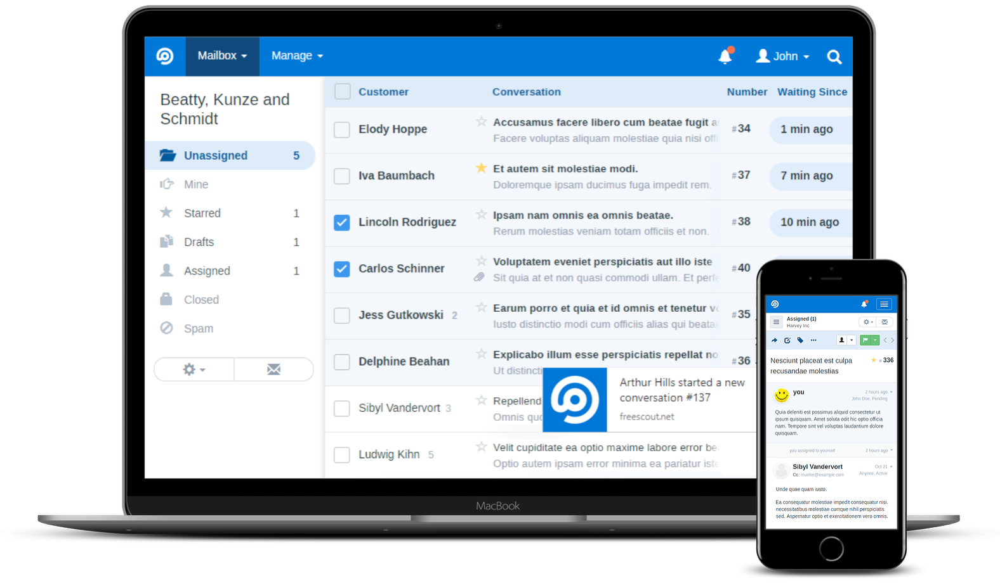

<!--
N.B.: Questo README è stato automaticamente generato da <https://github.com/YunoHost/apps/tree/master/tools/readme_generator>
NON DEVE essere modificato manualmente.
-->

# FreeScout per YunoHost

[](https://dash.yunohost.org/appci/app/freescout)  

[](https://install-app.yunohost.org/?app=freescout)

*[Leggi questo README in altre lingue.](./ALL_README.md)*

> *Questo pacchetto ti permette di installare FreeScout su un server YunoHost in modo semplice e veloce.*  
> *Se non hai YunoHost, consulta [la guida](https://yunohost.org/install) per imparare a installarlo.*

## Panoramica

FreeScout is the super lightweight and powerful free open source help desk and shared inbox built with PHP (Laravel framework). Now you can enjoy free Zendesk & Help Scout without giving up privacy or locking yourself into a service you don't control.

**Versione pubblicata:** 1.8.130~ynh1

**Prova:** <https://demo.freescout.net/login>

## Screenshot



## :red_circle: Anti-funzionalità

- **Applicazione con licenza parzialmente libera**: Quest’applicazione è protetta da licenza generalmente libera, ma con delle clausole che potrebbero limitare il suo utilizzo.

## Documentazione e risorse

- Sito web ufficiale dell’app: <https://freescout.net/>
- Documentazione ufficiale per gli amministratori: <https://github.com/freescout-helpdesk/freescout/wiki/Installation-Guide>
- Repository upstream del codice dell’app: <https://github.com/freescout-helpdesk/freescout>
- Store di YunoHost: <https://apps.yunohost.org/app/freescout>
- Segnala un problema: <https://github.com/YunoHost-Apps/freescout_ynh/issues>

## Informazioni per sviluppatori

Si prega di inviare la tua pull request alla [branch di `testing`](https://github.com/YunoHost-Apps/freescout_ynh/tree/testing).

Per provare la branch di `testing`, si prega di procedere in questo modo:

```bash
sudo yunohost app install https://github.com/YunoHost-Apps/freescout_ynh/tree/testing --debug
o
sudo yunohost app upgrade freescout -u https://github.com/YunoHost-Apps/freescout_ynh/tree/testing --debug
```

**Maggiori informazioni riguardo il pacchetto di quest’app:** <https://yunohost.org/packaging_apps>
