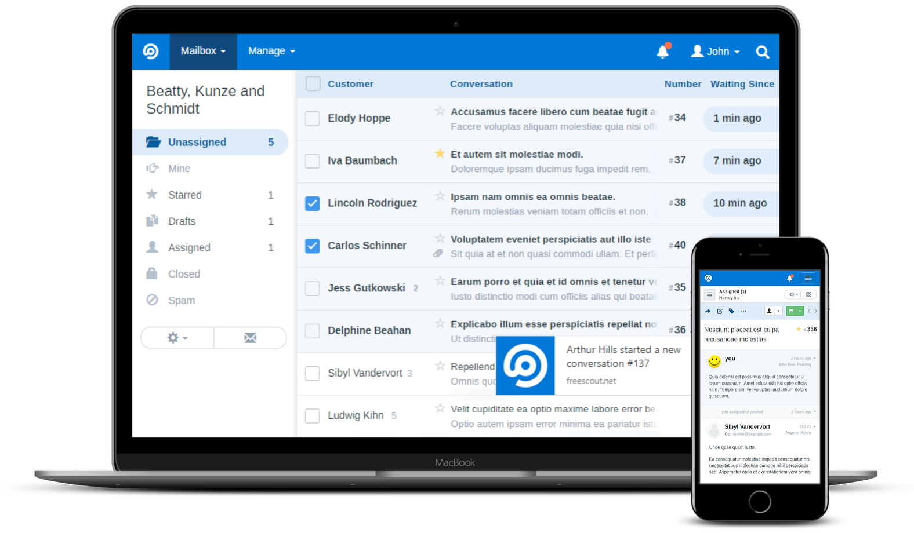

<!--
NB: Deze README is automatisch gegenereerd door <https://github.com/YunoHost/apps/tree/master/tools/readme_generator>
Hij mag NIET handmatig aangepast worden.
-->

# FreeScout voor Yunohost

[](https://ci-apps.yunohost.org/ci/apps/freescout/)


[](https://install-app.yunohost.org/?app=freescout)

*[Deze README in een andere taal lezen.](./ALL_README.md)*

> *Met dit pakket kun je FreeScout snel en eenvoudig op een YunoHost-server installeren.*  
> *Als je nog geen YunoHost hebt, lees dan [de installatiehandleiding](https://yunohost.org/install), om te zien hoe je 'm installeert.*

## Overzicht

FreeScout is the super lightweight and powerful free open source help desk and shared inbox built with PHP (Laravel framework). Now you can enjoy free Zendesk & Help Scout without giving up privacy or locking yourself into a service you don't control.

**Geleverde versie:** 1.8.160~ynh1

**Demo:** <https://demo.freescout.net/login>

## Schermafdrukken



## :red_circle: Anti-eigenschappen

- **Not totally free upstream**: The packaged app is under an overall free license, but with clauses that may restrict its use.

## Documentatie en bronnen

- Officiele website van de app: <https://freescout.net/>
- Officiele beheerdersdocumentatie: <https://github.com/freescout-helpdesk/freescout/wiki/Installation-Guide>
- Upstream app codedepot: <https://github.com/freescout-helpdesk/freescout>
- YunoHost-store: <https://apps.yunohost.org/app/freescout>
- Meld een bug: <https://github.com/YunoHost-Apps/freescout_ynh/issues>

## Ontwikkelaarsinformatie

Stuur je pull request alsjeblieft naar de [`testing`-branch](https://github.com/YunoHost-Apps/freescout_ynh/tree/testing).

Om de `testing`-branch uit te proberen, ga als volgt te werk:

```bash
sudo yunohost app install https://github.com/YunoHost-Apps/freescout_ynh/tree/testing --debug
of
sudo yunohost app upgrade freescout -u https://github.com/YunoHost-Apps/freescout_ynh/tree/testing --debug
```

**Verdere informatie over app-packaging:** <https://yunohost.org/packaging_apps>
